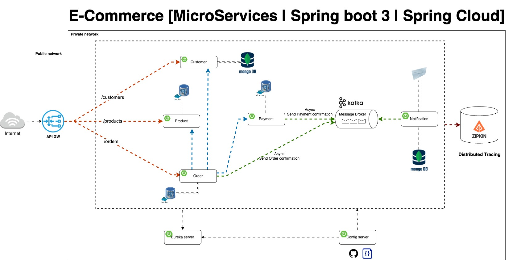

# Spring-Boot-Microservices-Ecommerce

[](https://github.com/chensoul/spring-boot-microservices-ecommerce/actions/workflows/maven-build.yml)
[](https://opensource.org/licenses/Apache-2.0)

该项目是一个电商的[微服务](http://www.martinfowler.com/articles/microservices.html)
项目，最初源自 [Mastering Microservices: Spring boot, Spring Cloud and Keycloak In 7 Hours](Mastering
Microservices: Spring boot, Spring Cloud and Keycloak In 7 Hours)，在参考了多个微服务项目之后做了一些优化和改进。

[](https://codespaces.new/spring-petclinic/spring-petclinic-microservices)

## 概述

该项目由几个微服务组成：

- 客户服务
- 通知服务
- 订单服务
- 支付服务
- 产品服务
- API 网关：将客户端请求路由到适当的服务。
- 配置服务器：所有服务的集中配置管理。
- 发现服务器：基于Eureka的服务注册中心。
- 认证服务器：基于OAuth2的认证服务。

各服务地址：

- Customer service - http://localhost:8020
- Notification service - http://localhost:8030
- Order service - http://localhost:8040
- Payment service - http://localhost:8050
- Product service - http://localhost:8060
- Discovery Server - http://localhost:8761
- Config Server - http://localhost:8888
- API Gateway - http://localhost:8080 或者 https://localhost:8443
- Authorization Server - http://localhost:9999
- Tracing Server (Zipkin) - http://localhost:9411/zipkin/
- Grafana - http://localhost:3000
- Prometheus - http://localhost:9090
- Spring Boot Admin - http://localhost:8090

每个服务都有自己特定的角色，并通过 REST API 进行通信。

## 技术栈

| 技术选型                                    | 使用版本     | 最新版本                                                                                                                                                                                                                                  | 备注 |
|-----------------------------------------|----------|---------------------------------------------------------------------------------------------------------------------------------------------------------------------------------------------------------------------------------------|----|
| Java                                    | 21       | 23                                                                                                                                                                                                                                    |    |
| Maven                                   | 3.9.9    | 3.9.9                                                                                                                                                                                                                                 |    |
| PostgreSQL                              | 17       | 17                                                                                                                                                                                                                                    |    |
| MongoDB                                 | 8        | 8.0.1                                                                                                                                                                                                                                 |    |
| Rabbitmq                                | 4        | 4                                                                                                                                                                                                                                     |    |
| Kafka                                   | 3.8      | 3.8                                                                                                                                                                                                                                   |    |
| ActiveMQ                                | 6        |                                                                                                                                                                                                                                       |    |
| Kubernetes                              | 1.31     |                                                                                                                                                                                                                                       |    |
| Grafana (Prometheus/Grafana/Loki/Tempo) |          |                                                                                                                                                                                                                                       |    |
| Spring Boot                             | 3.3.4    |      |    |
| Spring Boot Admin                       | 3.3.4    |                                    |    |
| Spring Cloud                            | 2023.0.3 |  |    |
| SprignDoc OpenAPI                       | 2.6.0    |                                            |    |

## 应用架构



## 章节介绍

- Chapter00：Docker
- Chapter01：Restful接口、持久化、SpringDoc OpenAPI
- Chapter02：异步通信
  - Chapter02-activemq
  - Chapter02-kafka
  - Chapter02-rabbitmq
  - Chapter02-spring-cloud-stream
- Chapter03：OpenFeign
- Chapter04：服务发现 Eureka
- Chapter05：服务网关 Spring Cloud Gateway
- Chapter06：配置服务 Spring Cloud Config
- Chapter07：监控服务 Spring Boot Admin
- chapter08: 链路追踪 Zipkin
- chapter09: 监控 Micrometer、Grafana
- chapter10: 监控 Micrometer、Grafana、Tempo、Loki
- chapter11: 混沌工程 Chaos Engineering
- chapter12: 认证服务 Spring Security OAuth2
- chapter13: Service Mesh
- chapter13: EFK
- chapter14: Native

## 环境准备

- [Git](https://git-scm.com/downloads)
- [Docker](https://docs.docker.com/get-docker/)
- [Java](https://www.azul.com/downloads/#zulu)
- [Curl](https://curl.haxx.se/download.html)
- [Jq](https://stedolan.github.io/jq/download/)
- [Spring Boot CLI](https://docs.spring.io/spring-boot/docs/3.0.4/reference/html/getting-started.html#getting-started.installing.cli)
- [Siege](https://github.com/JoeDog/siege#where-is-it)
- [Helm](https://helm.sh/docs/intro/install/)
- [kubectl](https://kubernetes.io/docs/tasks/tools/install-kubectl-macos/)
- [Minikube](https://minikube.sigs.k8s.io/docs/start/)
- [Istioctl](https://istio.io/latest/docs/setup/getting-started/#download)

安装软件：

```bash
/bin/bash -c "$(curl -fsSL https://raw.githubusercontent.com/Homebrew/install/HEAD/install.sh)"

brew install orbstack
brew install spring-io/tap/spring-boot 
brew install openjdk@21 
brew install maven
brew install jq 
brew install siege 
brew install helm
brew install minikub 
brew install kubectl 
brew install istioctl

echo 'export JAVA_HOME=$(/usr/libexec/java_home -v8)' >> ~/.bash_profile
source ~/.bash_profile
```

验证版本：

```bash
git version && \
docker version -f json | jq -r .Client.Version && \
java -version 2>&1 | grep "openjdk version" && \
mvn -v | grep "Maven" && \
curl --version | grep "curl" | sed 's/(.*//' && \
jq --version && \
spring --version && \
siege --version 2>&1 | grep SIEGE && \
helm version --short && \
kubectl version --client -o json | jq -r .clientVersion.gitVersion && \
minikube version | grep "minikube" && \
istioctl version --remote=false
```

## 项目构建

首先进入Chaptero1，如何依次运行下面命令构建 api、framework 模块

```bash
cd Chapter01

cd api && mvn install -DskipTests && cd ..
cd framework && mvn install -DskipTests && cd ..
```

然后，进入某个章节，编译 microservices

```bash
cd Chapter01/microservices
mvn clean install
```

缓存依赖

```bash
mvn dependency:go-offline
```

生成 JavaDoc

```bash
mvn -ntp javadoc:javadoc --batch-mode
```

## 测试

### 本地运行服务

通过 Spring Boot Maven 插件运行服务

```bash
mvn clean spring-boot:run -DskipTests
```

也可以使用调试模型运行

```bash
mvn spring-boot:run -DskipTests -Dspring-boot.run.jvmArguments="-agentlib:jdwp=transport=dt_socket,server=y,suspend=n,address=*:8000"
```

### 使用 Docker 运行服务

在某个章节的 microservices 目录下面，使用 Maven 插件构建镜像。

```bash
cd Chapter01/microservices
mvn -ntp spring-boot:build-image -DskipTests
```

如果想将镜像推送到 docker hub，运行下面命令：

```bash
mvn spring-boot:build-image -DskipTests \
  -Ddocker.publishRegistry.username=user \
  -Ddocker.publishRegistry.password=secret \
  -Dspring-boot.build-image.publish=true
```

在某个章节的根目录下使用 docker 启动服务：

```bash
cd Chapter01
docker-compose -f app.yml up -d
```

### 使用 K8s 运行服务

### 使用 Sonar 检测代码质量

你可以使用以下命令启动本地 Sonar 服务器（可通过[http://localhost:9001](http://localhost:9001/)访问）：

```bash
cd Chapter01
docker compose -f sonar.yml up -d
```

注意：我们已经关闭了 sonar.yml 中 UI 的强制身份验证重定向，以便在尝试 SonarQube 时获得开箱即用的体验，对于实际用例，请将其重新打开。

然后，运行 Sonar 分析：

```bash
cd microservices
mvn clean verify -DskipTests sonar:sonar -Dsonar.login=admin -Dsonar.password=admin
```

> Sonar 默认的用户名和密码为 admin/admin，如果你修改了密码，请使用新密码。

## 参考

### 视频

以下是介绍微服务项目的视频：

- [Mastering Microservices: Spring boot, Spring Cloud and Keycloak In 7 Hours](Mastering Microservices: Spring boot,
  Spring Cloud and Keycloak In 7 Hours)
- [Distributed version of the Spring PetClinic Sample Application built with Spring Cloud and Spring AI](https://github.com/odedia/spring-petclinic-microservices)
- [Spring Boot 3 Microservices with Kubernetes and Angular Complete Course in 7 Hours](https://www.youtube.com/watch?v=yn_stY3HCr8)

### 源代码

以下是 github 上微服务项目源代码：

- https://github.com/chensoul/Microservices-with-Spring-Boot-and-Spring-Cloud-Third-Edition
- https://github.com/chensoul/spring-petclinic-microservices
- https://github.com/chensoul/spring-boot-microservices
- https://github.com/chensoul/spring-boot-3-microservices-course
- https://github.com/in28minutes/spring-microservices-v3
- https://github.com/ali-bouali/microservices-full-code

- https://github.com/jhipster/jhipster-lite
